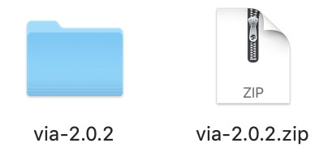
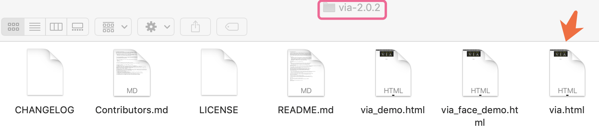
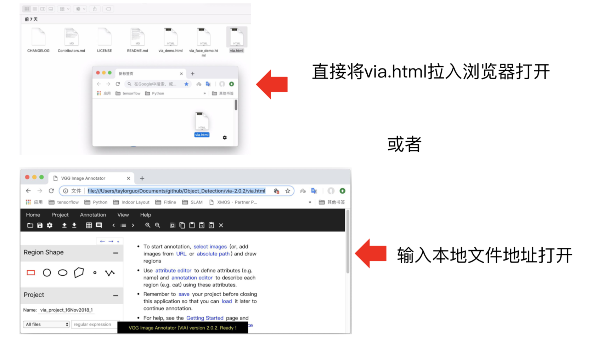
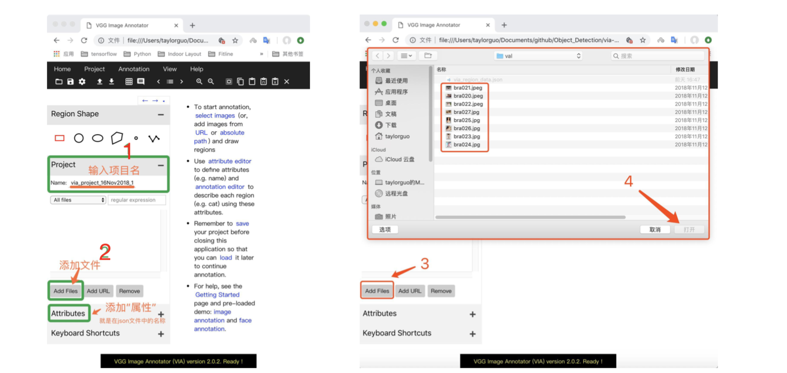
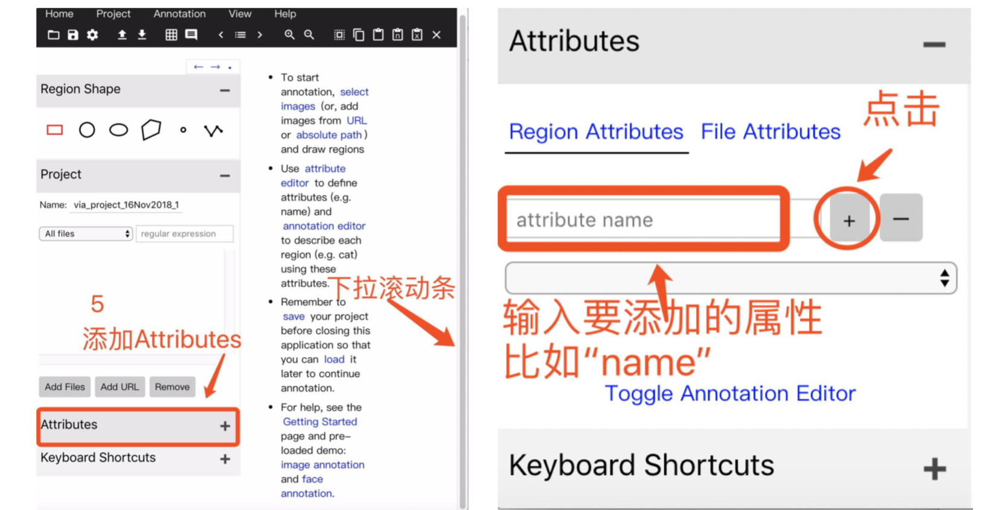
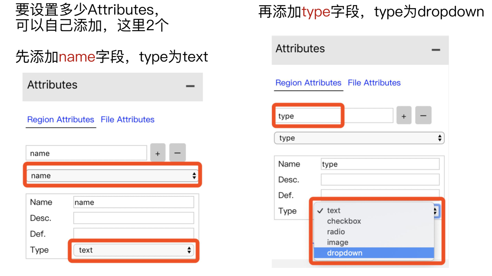
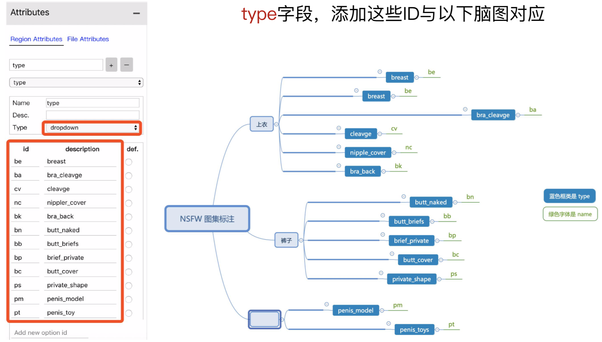
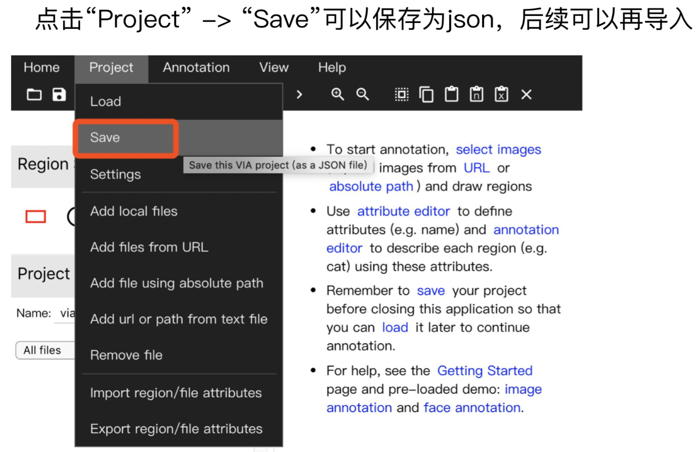
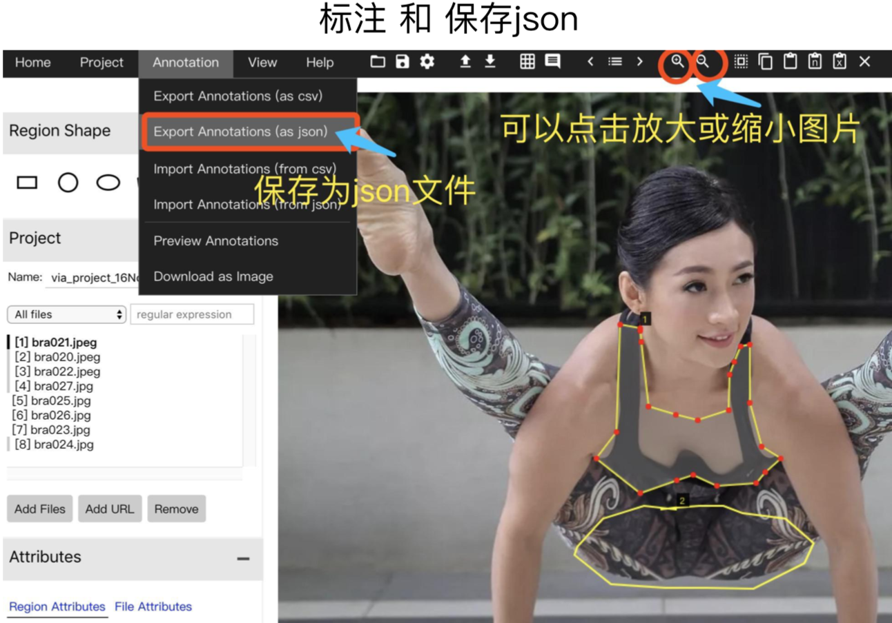
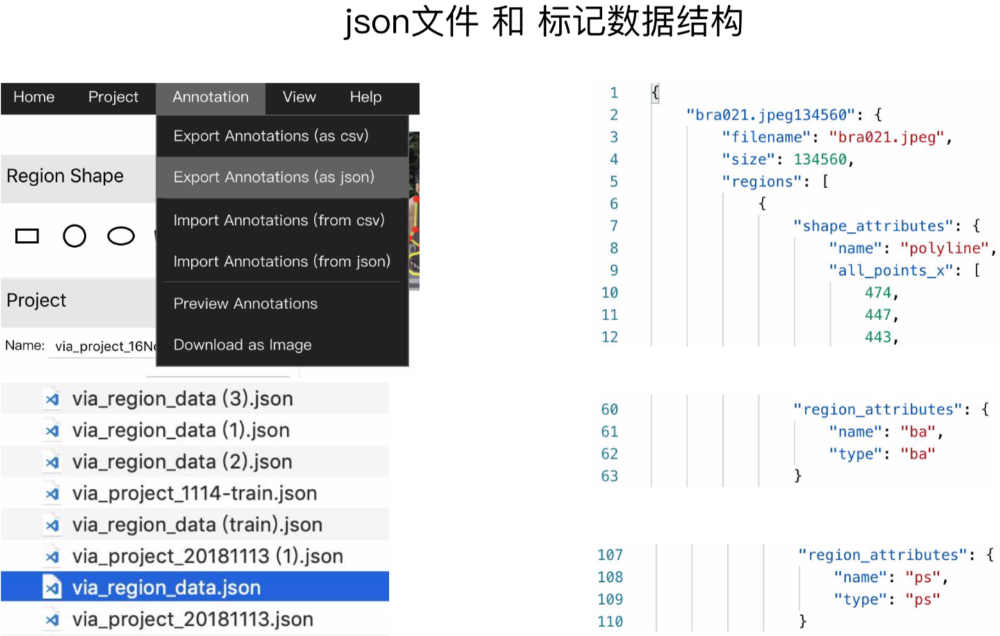

# Image Annotation Tools Summary

=======================================
## VGG Image Annotator （VIA）图像标注工具用户指南

### VIA 简介

VGG Image Annotator (VIA)是一款开源的图像标注工具，由牛津大学计算机视觉组 Visual Geometry Group开发。可以在线和离线使用，可标注矩形、圆、椭圆、多边形、点和线。标注完成后，可以导出为csv和json文件格式。

### VIA 下载

#### 1.  [VIA项目主页](http://www.robots.ox.ac.uk/~vgg/software/via/)

#### 2. 文件与解压目录

### VIA 使用步骤 (以低俗图像识别项目为例)

#### 1. 打开标注工具

#### 2. 项目信息设置，添加图像文件

#### 3. 设置属性信息，添加属性字段

#### 4. 暂存项目 ⚠️

#### 5. 开始标注
 

#### 6. 标注完成，导出Json文件 ⚠️
 

#### 7. 查看Json数据结构

=======================================

## [Yolov2 & Yolov3 图像标注工具GUI](https://github.com/AlexeyAB/Yolo_mark)

### 克隆源代码, 根据平台进行编译, 生成工具

    - 依赖项为 

        [OpenCV](https://github.com/opencv/opencv/releases)

        [opencv_contrib](https://github.com/opencv/opencv_contrib/releases)

=======================================

## [Pixel Annotation Tool](https://github.com/abreheret/PixelAnnotationTool/releases)

    - [macos](https://github.com/abreheret/PixelAnnotationTool/releases/download/v1.3.2/PixelAnnotationTool_x86_64_v1.3.2.dmg)

=======================================

## [Anno-Mage: 半自动图像标注工具](https://github.com/virajmavani/semi-auto-image-annotation-tool)

    - 利用训练好的物体检测模型标注出图像中所属COCO类别的物体框

=======================================
## [LabelImg](https://github.com/tzutalin/labelImg)

